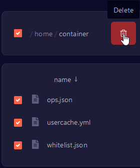

A comprehensive guide to fixing the exception in tick loop error.

## Introduction

This guide will walk you through the process of fixing the "java.lang.NullPointerException: Exception in server tick loop at net.minecraft.server.v1_7_R3.JsonList.load(JsonList.java:171)" error.

## Prerequisites

-   Access to the [Kiwi Hosting Panel](https://gmp.kiwihosting.net).
-   A running Minecraft Java Edition server managed through Kiwi Hosting Panel.
-   Basic understanding of server management.

## Steps to Fix Session Lock errors

### 1. Log in to the Kiwi Hosting Panel

1. Open your web browser and go to [gmp.kiwihosting.net](https://gmp.kiwihosting.net).
2. Log in with your Kiwi Hosting Panel credentials.

### 2. Navigate to Your Server

1. From the Kiwi Hosting Panel dashboard, select the Minecraft server you want to configure.
2. Click on the server name to access its management page.

### 3. Stop your server (if running)

1. Press the "Stop" button on the top right of the panel.

### 4. Access the File Manager

1. In the server management interface, navigate to the **File** tab.
3. Delete the `ops.josn`, `usercache.yml`, and `whitelist.json` files

### 5. Start your server

1. After making the necessary changes
2. Go back to the server management interface and start the server.

## Conclusion

By fixing the "java.lang.NullPointerException: Exception in server tick loop at net.minecraft.server.v1_7_R3.JsonList.load(JsonList.java:171)" crash, you can now start your server without a crash.
